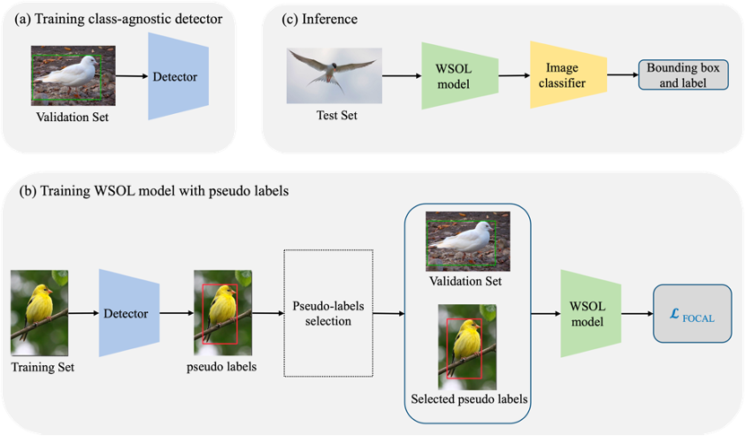
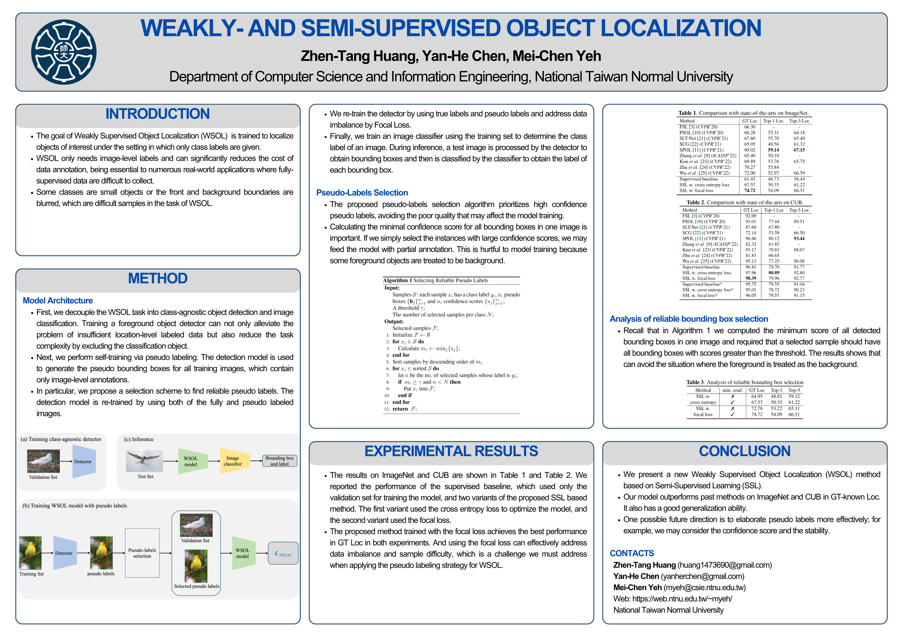

# Weakly- and Semi-Supervised Object Localization (ICASSP 2023)

[](https://ieeexplore.ieee.org/document/10096663)
[](https://2023.ieeeicassp.org/)
[](https://doi.org/10.1109/ICASSP49357.2023.10096663)

> **Weakly- and Semi-Supervised Object Localization**
> Zhen-Tang Huang, Yan-He Chen, Mei-Chen Yeh
> *IEEE International Conference on Acoustics, Speech and Signal Processing (ICASSP), 2023*

## Abstract

Weakly supervised object localization deals with the lack of location-level labels to train localization models. Recently a new evaluation protocol is proposed in which full supervision is available but limited to only a small validation set. It motives us to explore semi-supervised learning for addressing this problem. In particular, the localization model is developed via self-training: we use a small amount of data with full supervision to train a class-agnostic detector, and use it to generate pseudo bounding boxes for data with weak supervision. Furthermore, we propose a selection algorithm to discover high-quality pseudo labels, and deal with data imbalance caused by pseudo labeling. We demonstrate the superiority of the proposed method with performance on par with the state of the art on two benchmarks.

**Index Terms** — weakly supervised object localization, semi-supervised learning, deep learning

## Background: Weakly Supervised Object Localization (WSOL)

**What is WSOL?**
- Different from fully-supervised object localization that requires **location-level labels** (e.g., bounding boxes) of each training instance, WSOL has only **image-level labels**
- A WSOL model is trained to **localize objects of interest** under the setting in which only class labels are given
- WSOL alleviates a huge amount of human efforts to annotate training samples

**Why WSOL Matters:**
- **Reduces annotation cost**: WSOL significantly reduces the data annotation cost
- **Real-world applicability**: Essential to numerous real-world applications where fully-supervised data are difficult to collect, including:
  - Autonomous driving
  - Defect detection in industrial inspection
- **Learning under uncertainty**: Models must learn to localize without explicit location supervision

**Challenges in WSOL:**
- Some classes contain **small objects** or have **blurred foreground-background boundaries**, making them difficult to localize
- Classes have **different numbers of samples** with varying difficulty levels (data imbalance)
- Recent WSOL methods have not made a major improvement over the class activation mapping (CAM) baseline

## Motivation

- Choe et al. find the WSOL problem **ill-posed with only image-level labels** and propose an evaluation protocol where a **small validation set with full supervision** is available
- This study also shows that recent WSOL methods have not made a major improvement over the CAM baseline
- More interestingly, a **few-shot learning method outperforms existing WSOL methods**, where the full-supervision at validation time is used for model training instead
- Considering that **a small amount of data with full supervision** and **a large amount of data with weak supervision** are both available for training a WSOL model, we propose a new approach that explores **semi-supervised learning (SSL)** to tackle this problem
- **Key Question**: How can we effectively incorporate both weak and full supervision to improve WSOL performance?

<p align="center">
  
</p>

## Main Contributions

1. **First SSL-based WSOL Method**: We propose a SSL based method to address the WSOL problem. To the best of our knowledge, we are among the first that explore SSL to tackle this problem.

2. **Identify Key Challenges**: We identify the challenges in developing a SSL based method for WSOL, including the training of a robust base detector using a few labeled samples per class and training with long-tailed distributed data caused by pseudo labeling. The proposed method addresses both issues.

3. **State-of-the-Art Performance**: We evaluate the proposed method on WSOL benchmarks and show that it improves previous methods by a large margin in localization accuracy. We further conduct a cross-dataset evaluation to demonstrate its generalization capability.

## Method

The overview of our method is displayed in the figure above. We decouple the WSOL task into **class-agnostic object detection** and **image classification**, alleviating the requirement of abundant samples per class to train a robust detector.

**Overview of Our Approach:**
1. First, we train an object detection model using the **validation set**, in which the bounding boxes of samples are given
2. Then use the **training set** to perform self-training via pseudo labeling
3. We propose a **selection scheme** to find reliable pseudo labels
4. The detection model is **re-trained** by using both the fully and pseudo labeled images
5. Finally, we train an **image classifier** to determine the class label

**Benefits of SSL Method:**
- Modern fully-supervised object detection techniques can be applied to WSOL
- One benefit is that we can leverage powerful detection models like YOLOv5

**Challenges in SSL for WSOL:**
- The object detection model—trained with **few data**—must reach a reasonable performance to infer pseudo labels from weakly labeled data
- The model will be trained inevitably with **imbalanced data** because the number of pseudo labels inferred by the model may differ significantly for each class
- The amount of pseudo labels created from **difficult samples** would be small if we screen the pseudo labels by quality (e.g., confidence score of the detection)

### Stage 1: Training Class-Agnostic Detector

We first train a class-agnostic detection model with the validation set containing only a few location-level labeled samples. The base detector model must reach a good detection accuracy because it will be used to infer the pseudo labels from the training set.

**Implementation Details:**
- We develop the base detection model upon **YOLOv5**, which is a modern model for fully supervised object detection
- Trained with only the **validation set** (very few labeled samples per class)

**Why Class-Agnostic?**
- We train a **class-agnostic detector**, in which the model aims to localize foreground objects
- With the labeled data in the validation set, it is **difficult to train YOLO to simultaneously perform localization and classification**
- The **localization task** requires the extraction of **global features** from the whole object
- The **classification task** often relies on the most discriminative part (**local features**) of the object
- These two objectives can **conflict** with each other when training data is scarce

**Benefits of Class-Agnostic Approach:**
- **Alleviates insufficient data problem**: Training a foreground object detector can alleviate the problem of insufficient location-level labeled data
- **Reduces task complexity**: Excluding the classification objective reduces the task complexity
- **Focus on localization capability**: We focus on the capability of the model to localize foreground objects, subsequently applied to produce pseudo labels from weakly labeled training data

### Stage 2: Self-Training via Pseudo Labeling

We perform self-training via pseudo labeling—the detection model is used to generate the pseudo bounding boxes for all training images, which contain only image-level annotations.

**Key Insight:**
- The **quality** of pseudo labels is as important as the **quantity**
- Using low-quality pseudo labels might hinder the model from effective detection
- However, selecting only high-quality pseudo labels may lead to **data imbalance**: some categories may contain more data samples than others

### Pseudo-Labels Selection Algorithm

The usage of pseudo labels is important in semi-supervised learning. Specifically, the **trade-off between the quantity and the quality** of pseudo labels must be considered. The proposed pseudo-labels selection algorithm prioritizes high-confidence pseudo labels, avoiding the involvement of poor-quality ones that may deteriorate the model training and affect accuracy.

**Why Use Minimum Confidence Score?**
- The selection is performed based on the **confidence score** of a detected box returned by the detector
- If the confidence scores of **all** detected boxes are greater than the threshold, the sample is selected
- Note that the step of calculating the **minimal confidence score** for all bounding boxes in one image is important, which is **not as trivial as that in a classification task**
- In object localization we may have **more than one instance** in one sample
- If we simply select the instances with large confidence scores, we may feed the model with **partial annotation**
- This is **hurtful to model training** because some foreground objects are treated to be background

**Strict Selection Policy:**
- As we have a **large set of weakly labeled training samples**, we can take a strict selection policy
- Only those images whose bounding boxes scores are **all** greater than the threshold are selected
- This avoids the situation where foreground objects are mistakenly treated as background

```
Algorithm 1: Selecting Reliable Pseudo Labels
━━━━━━━━━━━━━━━━━━━━━━━━━━━━━━━━━━━━━━━━━━━━━━━━━━━━━━━━━━━━━━━━━━━━━━━━━━━━━━
Input:
    Samples S: each sample xᵢ has a class label yᵢ, nᵢ pseudo boxes {bⱼ}
              and nᵢ confidence scores {sⱼ}
    A threshold γ
    The number of selected samples per class N

Output:
    Selected samples F

━━━━━━━━━━━━━━━━━━━━━━━━━━━━━━━━━━━━━━━━━━━━━━━━━━━━━━━━━━━━━━━━━━━━━━━━━━━━━━
 1: Initialize F ← ∅
 2: for xᵢ ∈ S do
 3:     Calculate mᵢ ← minⱼ{sⱼ}
 4: end for
 5: Sort samples by descending order of mᵢ
 6: for xᵢ ∈ sorted S do
 7:     let n be the no. of selected samples whose label is yᵢ
 8:     if mᵢ ≥ γ and n < N then
 9:         Put xᵢ into F
10:     end if
11: end for
12: return F
━━━━━━━━━━━━━━━━━━━━━━━━━━━━━━━━━━━━━━━━━━━━━━━━━━━━━━━━━━━━━━━━━━━━━━━━━━━━━━
```

### Stage 3: Model Training and Inference

Despite that pseudo labeling is simple yet effective for utilizing unlabeled samples, it creates the **data imbalance problem** because classes have different amounts of hard samples. For some classes that are more difficult to detect, the number of selected samples is small, which exacerbates the difficulty of training the model for detecting those classes.

**Model Re-training:**
- The detection model is **re-trained** by using both of the fully and pseudo labeled images
- The WSOL model is trained with the **focal loss**, which can focus more on difficult samples during training
- Using the focal loss can effectively address **data imbalance** and **sample difficulty**, which is a challenge we must address when applying the pseudo labeling strategy for WSOL

**Inference Procedure:**
- We feed a test image into the WSOL model to obtain bounding boxes
- We use an **image classifier** to compute the class label for each box
- We use **ResNeXt101** and **NTSNET** models to train the image classifiers for ImageNet and CUB, respectively

## Experimental Setting

### Datasets

| Dataset | Description | Labeled Samples per Class |
|---------|-------------|---------------------------|
| **ImageNet** | Large-scale visual recognition | 10 samples (validation set) |
| **CUB** | Caltech-UCSD Birds-200-2011 | 5 samples (validation set) |

We followed the protocol specified in Choe et al. for dividing the data for training, validation and evaluation.

### Evaluation Metrics

Three evaluation metrics were applied to evaluate the performance:

| Metric | Description |
|--------|-------------|
| **GT-known Loc (GT Loc)** | Localization accuracy when ground-truth class is known (main metric) |
| **Top-1 Loc** | Localization accuracy with top-1 classification |
| **Top-5 Loc** | Localization accuracy with top-5 classification |

This study uses **GT Loc as the main evaluation metric** because the essence of WSOL is localization rather than classification. This echoes the claim made in Choe et al., in which the authors advocate the measurement of localization performance alone.

### Training Configuration

| Parameter | ImageNet | CUB |
|-----------|----------|-----|
| Epochs | 300 | 300 |
| Batch Size | 30 | 30 |
| N (samples per class) | 20 | 10 |
| Confidence Threshold γ | 0.9 | 0.95 |
| Total Pseudo-labeled Images | 19,032 | 1,518 |
| Training Data Usage | **2.3%** | **42%** |

All experiments were conducted on a machine with an **NVIDIA GeForce RTX 3090 GPU**.

## Experimental Results

### Comparison with State-of-the-Arts on ImageNet

| Method | GT Loc | Top-1 Loc | Top-5 Loc |
|--------|--------|-----------|-----------|
| FSL (CVPR'20) | 66.30 | - | - |
| PSOL (CVPR'20) | 66.28 | 55.31 | 64.18 |
| SLT-Net (CVPR'21) | 67.60 | 55.70 | 65.40 |
| SCG (CVPR'21) | 65.05 | 49.56 | 61.32 |
| SPOL (CVPR'21) | 69.02 | **59.14** | **67.15** |
| Zhang et al. (ICASSP'22) | 65.40 | 50.10 | - |
| Kim et al. (CVPR'22) | 69.89 | 53.76 | 65.75 |
| Zhu et al. (CVPR'22) | 70.27 | 55.84 | - |
| Wu et al. (CVPR'22) | 72.00 | 52.97 | 66.59 |
| Supervised baseline | 61.45 | 46.73 | 56.44 |
| SSL w. cross entropy loss | 67.57 | 50.35 | 61.22 |
| **SSL w. focal loss (Ours)** | **74.72** | 54.09 | 66.51 |

### Comparison with State-of-the-Arts on CUB

| Method | GT Loc | Top-1 Loc | Top-5 Loc |
|--------|--------|-----------|-----------|
| FSL (CVPR'20) | 92.00 | - | - |
| PSOL (CVPR'20) | 93.01 | 77.44 | 89.51 |
| SLT-Net (CVPR'21) | 87.60 | 67.80 | - |
| SCG (CVPR'21) | 72.14 | 53.59 | 66.50 |
| SPOL (CVPR'21) | 96.46 | 80.12 | **93.44** |
| Zhang et al. (ICASSP'22) | 82.32 | 61.85 | - |
| Kim et al. (CVPR'22) | 93.17 | 70.83 | 88.07 |
| Zhu et al. (CVPR'22) | 81.83 | 66.65 | - |
| Wu et al. (CVPR'22) | 95.13 | 77.25 | 90.08 |
| Supervised baseline | 96.81 | 79.70 | 91.77 |
| SSL w. cross entropy loss | 97.96 | **80.89** | 92.80 |
| **SSL w. focal loss (Ours)** | **98.39** | 79.96 | 92.77 |

### Cross-Dataset Generalization (Trained on ImageNet, Tested on CUB)

| Method | GT Loc | Top-1 Loc | Top-5 Loc |
|--------|--------|-----------|-----------|
| Supervised baseline* | 95.75 | 79.55 | 91.04 |
| SSL w. cross entropy loss* | 95.01 | 78.72 | 90.23 |
| **SSL w. focal loss*** | **96.05** | 79.57 | 91.15 |

Without using any data on CUB, our method trained with the focal loss achieves **96.05% GT Loc** and outperforms many state-of-the-art methods.

### Analysis of Reliable Bounding Box Selection

| Method | min. conf. | GT Loc | Top-1 | Top-5 |
|--------|------------|--------|-------|-------|
| SSL w. cross entropy | ✗ | 64.95 | 48.81 | 59.12 |
| SSL w. cross entropy | ✓ | 67.57 | 50.35 | 61.22 |
| SSL w. focal loss | ✗ | 72.76 | 53.22 | 65.11 |
| SSL w. focal loss | ✓ | **74.72** | **54.09** | **66.51** |

The accuracy of the model applying the proposed selection strategy is higher than that of the alternative. The results show that it is important to select pseudo labels carefully, as a trivial solution may lead to a situation where some instances may be regarded as background and thereby achieve an inferior performance.

### Key Findings

**Effectiveness of Using Weakly-Labeled Data:**
- The proposed SSL method improves the supervised baseline no matter which loss function is applied
- The model trained with the focal loss achieves **74.72% GT Loc** while the baseline achieves **61.45%** in the ImageNet experiment (improvement: **+13.27%**)
- The same observation on performance improvement can also be made in the CUB experiment (**98.39%** vs. **96.81%**)

**Effectiveness of Focal Loss:**
- Using **focal loss** can improve **7.15%** in GT Loc compared to cross entropy loss on ImageNet
- In CUB, the performance gain is also observed but is not significant
- Although we do not focus on classification in the proposed method, our performances on Top-1 Loc and Top-5 Loc are **competitive** to those of state-of-the-arts

**Data Efficiency:**
- The model is trained using only a small amount of training samples (those selected by the proposed algorithm)
- Only **2.3%** training data used in ImageNet
- Only **42%** training data used in CUB

**Cross-Dataset Generalization:**
- The proposed method provides an effective alternative to the few-shot learning baseline
- Trained on ImageNet, achieves **96.05% GT Loc** on CUB **without fine-tuning**
- The proposed method has good localization performance with different number of instances, illumination conditions and complex background

<p align="center">
  
</p>

*Localization results of the proposed method. Top: CUB, Bottom: ImageNet; Green: Ground Truth, Red: Ours.*

## Conclusion

We present a new WSOL method based on SSL. In this approach, we utilize the validation set to train a base model, and then use it to explore the training set via pseudo labeling. Extensive experimental results validate the design choices of the proposed method.

**Future Directions:**
- One possible future direction is to elaborate pseudo labels more effectively
- For example, we may consider the **confidence score** and the **stability** of pseudo labels

## Poster

<p align="center">
  
</p>

## Materials

| Resource | Link |
|----------|------|
| Paper (IEEE Xplore) | [Link](https://ieeexplore.ieee.org/document/10096663) |
| Paper (PDF) | [docs/paper.pdf](docs/paper.pdf) |
| Presentation Slides | [docs/slides.pdf](docs/slides.pdf) |
| Video Presentation | [assets/video.mp4](assets/video.mp4) |

## Citation

If you find this work useful, please cite:

```bibtex
@inproceedings{huang2023weakly,
  title={Weakly- and Semi-Supervised Object Localization},
  author={Huang, Zhen-Tang and Chen, Yan-He and Yeh, Mei-Chen},
  booktitle={IEEE International Conference on Acoustics, Speech and Signal Processing (ICASSP)},
  pages={1--5},
  year={2023},
  organization={IEEE},
  doi={10.1109/ICASSP49357.2023.10096663}
}
```
## Contact

- **Zhen-Tang Huang** - huang1473690@gmail.com
---

<p align="center">
  <i>Published at ICASSP 2023, Rhodes Island, Greece</i>
</p>
